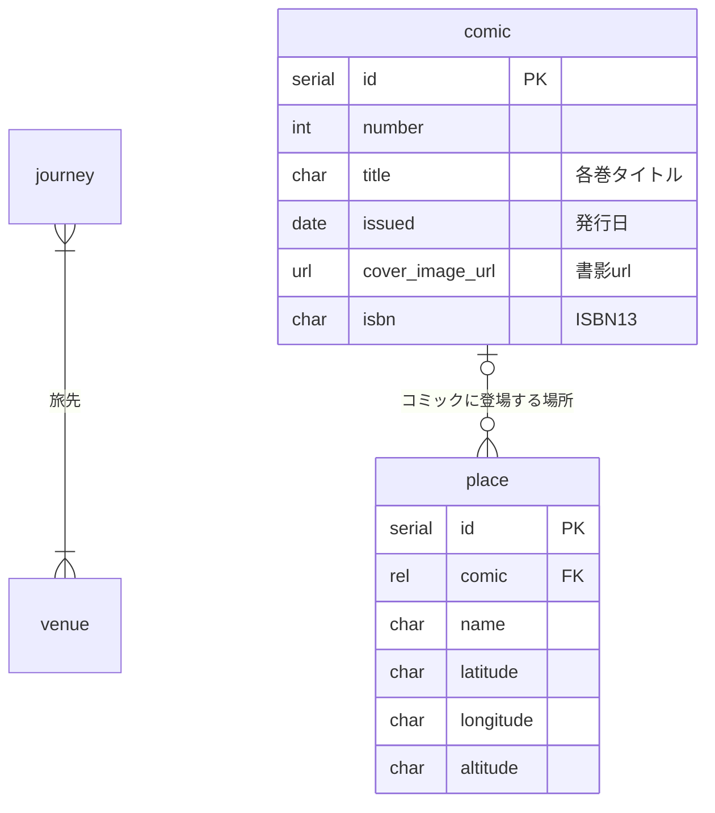

# mermaid2django

 entity-relationship Diagram that is written with mermaid's syntax convert into Django model class

WARNINGS; Work In Progress

***作りかけ注意***

## 概要

Mermaid記法で書いたER図を元にして、Django向けのコードに変換します。

まずModelクラスつまりmodels.pyの作成をサポートし、次にadmin.pyも生成できるようにします。
ただし機能的には限定的で、雛形を生成するという感じになります。

それというのも、models.py等で記述できることに対して、ER図が記述できる内容は情報量が少なくて、本質的に相互運用性がありません。
ですから、本件アプリケーションは「当初の設計・検討段階においてER図を用いて、そこからmodels.pyを得る」部分にフォーカスします。
一度models.pyが出来上がったら、以降はmodels.pyを正本として使って行くことを前提とします。

## まだ作りかけです

当初の目標とする機能は、ほぼできています。
生成したファイルを手直しして使う分には機能するかと思います。
まだ使い込みが不十分なので、アラが残っています。

## サポートする入力の形式

mermaid.mmd

Mermaid.jsでサポートしているER図のうち、よく使われる記法に限ってサポートしています。

また、独自の拡張や制限事項があります。
具体的にはコメントを使ってアノテーションの記述を行い、リレーション（FK）についてはコメント行を使ってテーブル名を記述します。

### リレーションシップ

### 属性のタイプ

int, text, date, datetime, serial

serialはシリアル型のPKのみ
intは
textは
char

細かいオプション指定は対応してません。
生成されたmodels.pyを適宜書き換えてください。

### コメント・ブロック

行頭「%%」の行はコメントです。
空行までの連続するコメント行は、一つのブロックとして扱います。

空行とは、連続した改行によって行の中身がカラの行のことです。

ただし、以下の通りコメントの直後（空行を挟まない）に記述する内容に関連付けて、アノテーションとして扱います。
それ以外の、空行と空行に挟まれたコメントは、特に意味を持ちません。

### エンティティのアノテーション

各エンティティの定義の直前にあるコメントは、そのエンティティに関連付けます

### 属性のアノテーション

各属性の定義の直前にあるコメントは、その属性に関連付けます

### FK リレーション先のエンティティを指定する

属性のアノテーションのうち、その属性がリレーションを持つ場合、リレーション先のエンティティ名を
アノテーションの冒頭に記述します。
エンティティ名称の後にコメント等を続けて記述する場合は、空白文字で区切ります。

### 記述例

